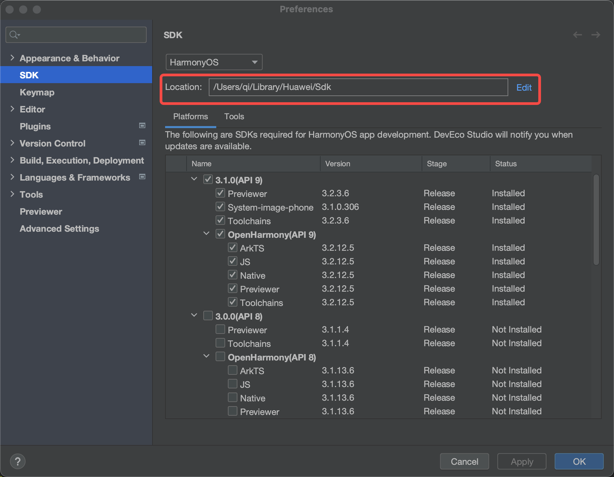
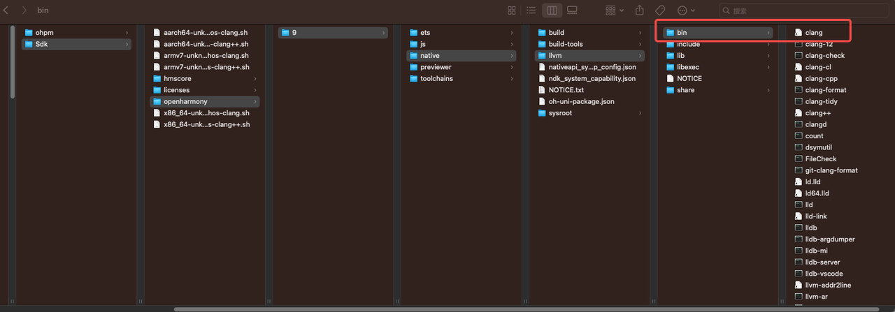
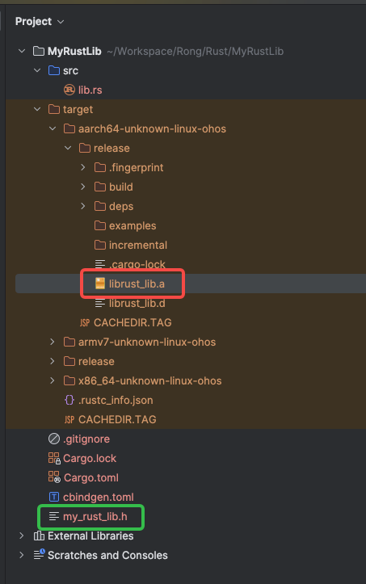
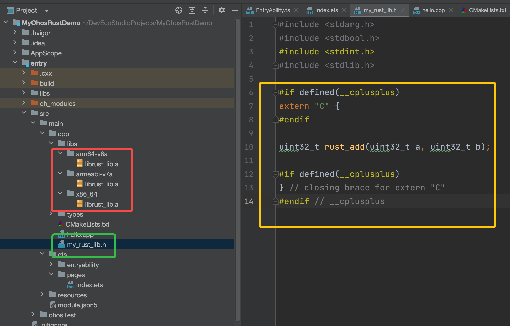

# 鸿蒙 Rust 调用

`MyRustLib` : Rust 项目，用于生成 .a 和 C 头文件

`MyOhosRustDemo` : 鸿蒙项目，集成 Rust 的 .a 和头文件

本文主要讲如何将 Rust 项目集成到鸿蒙项目中，以及如何调用 Rust 项目中的函数。

# 1. 环境准备

确保本地已具备
* 可以运行 Rust项目
    * Rust 程序设计语言 ：https://kaisery.github.io/trpl-zh-cn/title-page.html
    * 开发工具 RustRover-EAP ：https://www.jetbrains.com/rust/
* 可以运行鸿蒙项目
    * 开发工具 DevEco-Studio ： https://developer.harmonyos.com/cn/develop/deveco-studio/#download
    * 鸿蒙 C++ 编译（文档 5.5）：https://github.com/loginSin/HarmonyosRustDemo

下面的示例均在 Mac M1 芯片中运行，其他平台请自行适配。

# 2. Rust 交叉编译配置
Rust 默认支持编译的平台包含 iOS，Android，Windows，Linux ；不支持鸿蒙架构

所以需要先把鸿蒙架构给配置上，才能保证 Rust 正常生成鸿蒙架构的 .a 

```shell
# Rust 查看 cpu 架构清单
rustup target list
```

## 2.1 获取鸿蒙 SDK 路径

> 找到鸿蒙 SDK 路径，并保存起来

DevEco-Studio > Preferences > SDK > Location





```shell
# 本地鸿蒙 SDK 根路径
~/Library/Huawei/Sdk

# 本地鸿蒙 clang 路径
~/Library/Huawei/Sdk/openharmony/9/native/llvm/bin/clang
```

如果找不到 clang 路径，应该是鸿蒙环境没有搭建好，需要确保 clang 路径可以正常找到

## 2.2 生成 Rust linker 脚本

详细参考鸿蒙架构编译配置：https://doc.rust-lang.org/stable/rustc/platform-support/openharmony.html

三个 cpu 架构：arm64-v8a 、 armeabi-v7a、  x86_64

每个 cpu 架构一个 clang 脚本，一个 clang++ 脚本

共计 6 个脚本，建议将脚本放在鸿蒙 SDK 根路径上

```shell
➜ cd ~/Library/Huawei/Sdk
➜ tree -L 1
.
├── aarch64-unknown-linux-ohos-clang.sh      # arm64-v8a clang 脚本  
├── aarch64-unknown-linux-ohos-clang++.sh    # arm64-v8a clang++ 脚本
├── armv7-unknown-linux-ohos-clang.sh        # armeabi-v7a clang 脚本
├── armv7-unknown-linux-ohos-clang++.sh      # armeabi-v7a clang++ 脚本
├── x86_64-unknown-linux-ohos-clang.sh        # x86_64 clang 脚本
├── x86_64-unknown-linux-ohos-clang++.sh     # x86_64 clang++ 脚本
├── openharmony  # 鸿蒙 SDK
├── hmscore
└── licenses
```

下面为每个脚本的内容

**`clang/sysroot` 两个前面是 鸿蒙 SDK 本地路径**，如果本地路径和文档不一致，请按需改动

**`target` 参数对应的 Cpu 架构**，固定值

**Waring：注意此处的路径有 `~/` 开头的绝对路径（Rust 编译的时候会直接使用该值，必须为绝对路径）**

> 1. aarch64-unknown-linux-ohos-clang.sh

```shell
#!/bin/sh
exec ~/Library/Huawei/Sdk/openharmony/9/native/llvm/bin/clang \
  -target aarch64-linux-ohos \
  --sysroot=~/Library/Huawei/Sdk/openharmony/9/native/sysroot \
  -D__MUSL__ \
  "$@"
```

> 2. aarch64-unknown-linux-ohos-clang++.sh

```shell
#!/bin/sh
exec ~/Library/Huawei/Sdk/openharmony/9/native/llvm/bin/clang++ \
  -target aarch64-linux-ohos \
  --sysroot=~/Library/Huawei/Sdk/openharmony/9/native/sysroot \
  -D__MUSL__ \
  "$@"

```

> 3. armv7-unknown-linux-ohos-clang.sh

```shell
#!/bin/sh
exec ~/Library/Huawei/Sdk/openharmony/9/native/llvm/bin/clang \
  -target arm-linux-ohos \
  --sysroot=~/Library/Huawei/Sdk/openharmony/9/native/sysroot \
  -D__MUSL__ \
  -march=armv7-a \
  -mfloat-abi=softfp \
  -mtune=generic-armv7-a \
  -mthumb \
  "$@"
  
```

> 4. armv7-unknown-linux-ohos-clang++.sh

```shell
#!/bin/sh
exec ~/Library/Huawei/Sdk/openharmony/9/native/llvm/bin/clang++ \
  -target arm-linux-ohos \
  --sysroot=~/Library/Huawei/Sdk/openharmony/9/native/sysroot \
  -D__MUSL__ \
  -march=armv7-a \
  -mfloat-abi=softfp \
  -mtune=generic-armv7-a \
  -mthumb \
  "$@"
  
```

> 5. x86_64-unknown-linux-ohos-clang.sh

```shell
#!/bin/sh
exec ~/Library/Huawei/Sdk/openharmony/9/native/llvm/bin/clang \
  -target x86_64-linux-ohos \
  --sysroot=~/Library/Huawei/Sdk/openharmony/9/native/sysroot \
  -D__MUSL__ \
  "$@"

```

> 6. x86_64-unknown-linux-ohos-clang++.sh

```shell
#!/bin/sh
exec ~/Library/Huawei/Sdk/openharmony/9/native/llvm/bin/clang++ \
  -target x86_64-linux-ohos \
  --sysroot=~/Library/Huawei/Sdk/openharmony/9/native/sysroot \
  -D__MUSL__ \
  "$@"

```

## 2.3 生成 Rust config

生成 ~/.cargo/config 文件，在该配置文件中配置上述的脚本路径

文件内容如下

**Waring：注意此处的路径是没有 `~/` 开头的相对路径 （Rust 编译的时候会为相对路径自动为其拼接 ~/ 头）**

```shell
[target.aarch64-unknown-linux-ohos]
ar = "Library/Huawei/Sdk/openharmony/9/native/llvm/bin/llvm-ar"
linker  = "Library/Huawei/Sdk/aarch64-unknown-linux-ohos-clang.sh"

[target.armv7-unknown-linux-ohos]
ar = "Library/Huawei/Sdk/openharmony/9/native/llvm/bin/llvm-ar"
linker  = "Library/Huawei/Sdk/armv7-unknown-linux-ohos-clang.sh"

[target.x86_64-unknown-linux-ohos]
ar = "Library/Huawei/Sdk/openharmony/9/native/llvm/bin/llvm-ar"
linker  = "Library/Huawei/Sdk/x86_64-unknown-linux-ohos-clang.sh"
```

# 3. Rust 生成鸿蒙架构的 .a 和 C 头文件

## 3.1 生成 Rust lib 项目

创建 rust lib 项目，然后用 RustRover 打开项目

```shell
cargo init --lib MyRustLib
```

## 3.2 libc 生成 .a 

Rust FFI 编程 - libc crate：https://rustcc.cn/article?id=3a87a6b8-2f1c-4ac9-b962-5d9578eb5b1a

**libc 负责生成 C 的二进制文件**

### 3.2.1 添加 libc 的依赖

```shell
// Cargo.toml 配置文件

[package]
name = "MyRustLib"
version = "0.1.0"
edition = "2021"

[lib]                         // 声明是 SDK
name = "rust_lib"            // SDK 名称，后续会生成 lib{name}.a
crate-type = ["staticlib"]    // SDK 类型：静态库(.a 文件)

[dependencies]
libc = "0.2"                // 增加 libc 的依赖
```

### 3.2.2 使用 libc 声明 C  方法

```rust
// src/lib.rs

#![crate_type = "staticlib"]

#[no_mangle]
pub extern "C" fn rust_add(a:u32,b:u32) -> u32 {
    a + b
}
```

### 3.2.3 Rust 切换为 nightly

Rust 切换 nightly ： https://www.cnblogs.com/yxi-liu/p/10648372.html

Rust 常用的环境分为 stable 和 nightly ，本文编译 .a 需要使用 nightly 环境，否则会出现下面的 -Z 命令报错

```shell
# 安装 nightly
rustup install nightly

# 将 nightly 设为 default
rustup default nightly

# 查看 nightly 版本
rustc --version
```

### 3.2.4 生成 .a

顺序执行下面命令

下面命令中的 --target 参数就是使用 ~/.cargo/config 配置去调用对应的 linker 脚本

```shell
# 清空上次编译缓存
rm -rf target

# 编译 arm64-v8a
cargo build -Zbuild-std --release --target aarch64-unknown-linux-ohos --verbose

# 编译 armeabi-v7a
cargo build -Zbuild-std --release --target armv7-unknown-linux-ohos --verbose

# 编译 x86_64
cargo build -Zbuild-std --release --target x86_64-unknown-linux-ohos --verbose
```

编译出来的 .a 文件路径如下

```shell
➜  tree target -L 4

target                            # target 输出路径
│                           
├── aarch64-unknown-linux-ohos    # target arm64-v8a 
│   └── release                   # 输出路径
│       ├── librust_lib.a        # 生成的.a 
│
├── armv7-unknown-linux-ohos    # target armeabi-v7a
│   └── release                # 输出路径
│       ├── librust_lib.a        # 生成的.a 
│
└── x86_64-unknown-linux-ohos    # target x86_64
    └── release                # 输出路径
        ├── librust_lib.a       # 生成的.a 

```

## 3.3 cbindgen 生成 C 头文件

Rust FFI 编程 - cbindgen 工具介绍  ： https://rustcc.cn/article?id=a77aedb2-44f6-48aa-a032-954c87867068

### 3.3.1 安装 cbindgen

```shell
cargo install --force cbindgen
```

### 3.3.2 创建 cbindgen.toml

在 Cargo.toml 同级目录项创建 cbindgen.toml

```shell
// cbindgen.toml

language = "C"
```

### 3.3.3 使用 cbindgen 生成 .h

```shell
cbindgen --config cbindgen.toml --crate MyRustLib --output my_rust_lib.h
```

执行上面命令后在 cbindgen.toml 同级目录下生成的 my_rust_lib.h C 头文件

```c
// my_rust_lib.h

#include <stdarg.h>
#include <stdbool.h>
#include <stdint.h>
#include <stdlib.h>

uint32_t rust_add(uint32_t a, uint32_t b);
```

## 3.4 .a 和 C 头文件在 Rust 项目中的位置



# 4. 鸿蒙编译

使用 DevEco-Studio 创建鸿蒙 Native C++ 项目，里面默认实现了一个原生的 Add 方法，此处用 Rust 的 rust_add 方法将其实现替换

## 4.1 导入 .a 和头文件

1. 在 entry/src/main/cpp 下创建 libs/{Cpu 架构}/ 并将对应 Cpu 架构的 .a 放入指定的目录

```shell
➜  tree entry/src/main/cpp/libs -L 2
entry/src/main/cpp/libs            # .a 根路径
├── arm64-v8a                    # cpu 架构
│   └── librust_lib.a            # .a 文件
│
├── armeabi-v7a
│   └── librust_lib.a
│
└── x86_64
    └── librust_lib.a

```


2. 将头文件放入 `entry/src/main/cpp` 目录，保证文件和 CMakeLists.txt 同一个目录

3. 改造 C 头文件，保证其可以被 cpp 调用

```c
// my_rust_lib.h

#include <stdarg.h>
#include <stdbool.h>
#include <stdint.h>
#include <stdlib.h>

#if defined(__cplusplus)
extern "C" {
#endif

uint32_t rust_add(uint32_t a, uint32_t b);

#if defined(__cplusplus)
}
#endif
```



## 4.2 配置鸿蒙项目 CMakeLists.txt

```shell
# CMakeLists.txt

# the minimum version of CMake.
cmake_minimum_required(VERSION 3.4.1)
project(MyRust)

set(NATIVERENDER_ROOT_PATH ${CMAKE_CURRENT_SOURCE_DIR})

include_directories(${NATIVERENDER_ROOT_PATH}
                    ${NATIVERENDER_ROOT_PATH}/include)

# 指明 SDK 路径，CMAKE_OHOS_ARCH_ABI 是固定值
link_directories("libs/${CMAKE_OHOS_ARCH_ABI}")

add_library(entry SHARED hello.cpp)
target_link_libraries(entry PUBLIC libace_napi.z.so)

# 添加依赖，需要把 .a 文件开头的 lib 和后缀 .a 去掉
# 比如 SDK 名称为 librust_lib.a，则此处需要填 rust_lib
target_link_libraries(entry PRIVATE rust_lib)  
```

## 4.3 运行鸿蒙项目

修改 C++ 代码，使其调用 Rust 的 .a 方法

```cpp
// hello.cpp

#include "my_rust_lib.h"

static napi_value Add(napi_env env, napi_callback_info info)
{
    size_t requireArgc = 2;
    size_t argc = 2;
    napi_value args[2] = {nullptr};

    napi_get_cb_info(env, info, &argc, args , nullptr, nullptr);

    napi_valuetype valuetype0;
    napi_typeof(env, args[0], &valuetype0);

    napi_valuetype valuetype1;
    napi_typeof(env, args[1], &valuetype1);

    double value0;
    napi_get_value_double(env, args[0], &value0);

    double value1;
    napi_get_value_double(env, args[1], &value1);
    
    // 调用 Rust 的方法
    double sumValue = (double) rust_add((int)value0, (int)value1);
    
    napi_value sum;
    napi_create_double(env, sumValue, &sum);

    return sum;

}
```

修改 ArkTS 代码，使其调用原生接口

```ts
// Index.ets

import hilog from '@ohos.hilog';
import testNapi from 'libentry.so'

@Entry
@Component
struct Index {
  @State message: string = 'Hello World'

  build() {
    Row() {
      Column() {
        Text(this.message)
          .fontSize(50)
          .fontWeight(FontWeight.Bold)
          .onClick(() => {
            // 调用 Rust 接口
            this.message = "Rust add :" + testNapi.add(6, 3);

            hilog.info(0x0000, 'testTag', 'Test NAPI 2 + 3 = %{public}d', testNapi.add(2, 3));
          })
      }
      .width('100%')
    }
    .height('100%')
  }
}
```

## 4.4 运行效果

